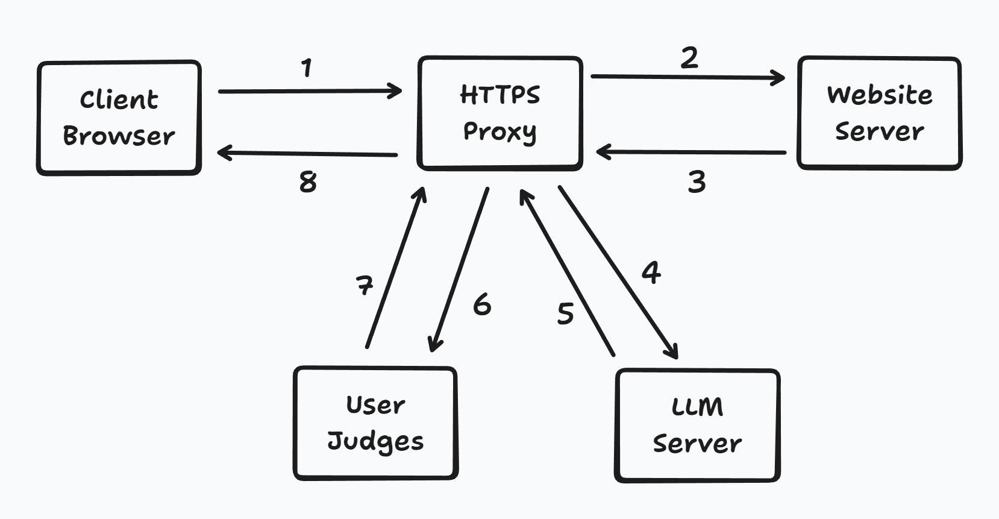

# Fake News Check

This is a project based on llm and HTTPS proxy.

I will add more details later.

## Introduction



The user interaction module is now in discussion and design stage. 

The plan is to allow users to click "Fake" or "Real", and maintain a simple community of fact checks.

But the fact check should based on the content or the website? This is still in discussion and will update in later versions.

## Quick Start

Make sure you have already set up the LLM API keys and make c file.

Make sure you have already set up the browser or testing environment.

For HTTPS proxy server: (Recommended Settings)

```bash
# Use LLM server.
./proxy 8080 proxy_ca.crt proxy_ca.key llm=true

# Don't use LLM server and will only inject info on headers.
# This is for testing proxy program to see if it is running correctly.
./proxy 8080 proxy_ca.crt proxy_ca.key llm=false
```

For LLM server:

```bash
# Normal Mode（Port: 5000）
python3 fake_news.py

# Test Mode（Independent test，don't need proxy，auto load fake_news_test.txt）
python3 fake_news.py test
```

More details will be added later, currently mainly focus on discussions with Tufts members.